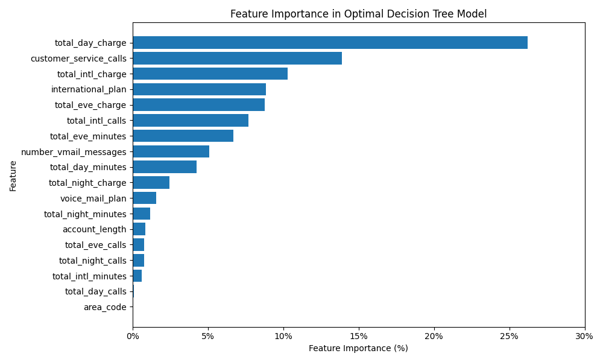
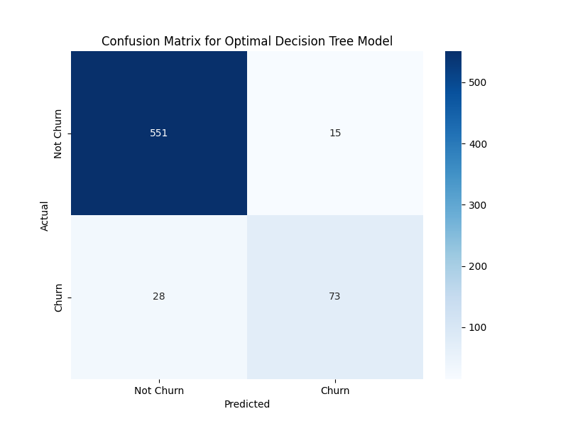
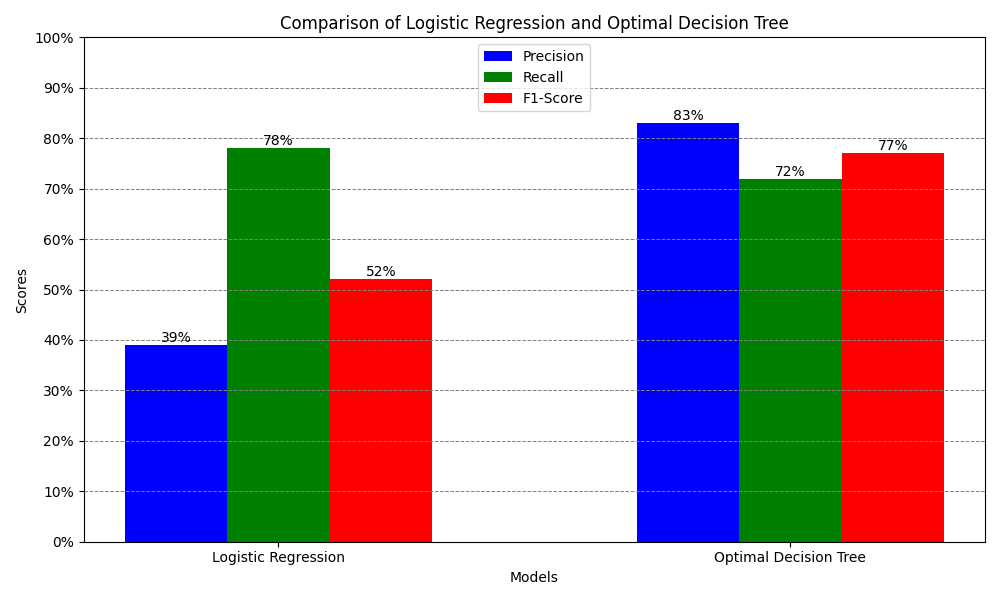

# Customer Churn Prediction Project

Author: Noah Meakins

## Project Overview

This project aims to predict customer churn for SyriaTel using machine learning models. The goal is to identify customers who are likely to churn and provide insights that can help the business take proactive measures.

The final model was built using a Decision Tree Classifier, with hyperparameter tuning applied to optimize performance. The project includes feature engineering, data preprocessing, model building, and evaluation, along with visualizations that provide actionable insights.

## Dataset

- **Source**: The dataset was sourced from Kaggle.
<https://www.kaggle.com/datasets/becksddf/churn-in-telecoms-dataset>

- **Columns**: The dataset consists of various customer details such as:
  - Total day charge
  - Customer service calls
  - International plan
  - Voice mail plan
  - Many other telecommunication features

The target variable is **churn**, which indicates whether a customer has churned (True) or not (False).

## Key Steps

1. **Data Preprocessing**:
   - Removed unnecessary features such as `state` and `phone_number`.
   - Scaled the numeric features for better model performance.
   - Addressed class imbalance using SMOTE.

2. **Model Building and Evaluation**:
   - Tried Logistic Regression, Decision Tree, and tuned the Decision Tree for better performance.
   - Used metrics such as Accuracy, Precision, Recall, and F1-Score to evaluate model performance.
   - Applied hyperparameter tuning to find the optimal parameters for the Decision Tree.

3. **Visualizations**: Created visualizations to highlight feature importance, model comparisons, and the final results.

## Key Results

- **Final Model**: The optimal model selected was the Decision Tree Classifier with hyperparameters:
  - `max_depth=12`
  - `min_samples_split=5`
  - `min_samples_leaf=5`
  - `max_features=14`
  
- **Model Performance**:
  - Accuracy: 94%
  - Precision for Churn Class: 83%
  - Recall for Churn Class: 72%
  - F1-Score for Churn Class: 77%

### Findings and Recommendations

#### Findings

1. **Model Performance**: The final Decision Tree Classifier model performed well with an accuracy of 94%. The precision for predicting churn is 83%, while recall is 72%. This means the model is quite effective in identifying customers who are likely to churn while reducing false positives.

2. **Feature Importance**: The most influential features in predicting customer churn were:
   - **Total Day Charge**: This feature was the most significant driver for customer churn.
   - **Customer Service Calls**: Customers who made frequent calls to customer service were more likely to churn.
   - **International Plan**: Customers with an international plan had a higher likelihood of churning.

   These insights allow us to understand which customer behaviors most strongly predict churn and provide guidance for targeted retention strategies.

3. **Comparison of Models**: The optimized Decision Tree model outperformed Logistic Regression in terms of both precision and recall, particularly in reducing false positives for churn prediction. However, Logistic Regression had a higher recall (78%) in identifying churners but at the expense of more false positives.

#### Recommendations

1. **Use Case for Model Predictions**:
   - The model is well-suited for identifying **high-risk churners** based on key features such as `Total Day Charge` and `Customer Service Calls`. The predictions can help the business target customers for retention strategies, such as offering discounts or personalized plans.
   - However, the model may under-perform in situations where recall is critical. For example, in situations where it's more important to identify as many churners as possible (even at the expense of false positives), this model's recall might need to be improved.

2. **Business Actions**:
   - **Focus on Customer Service**: Since high customer service interactions correlate with churn, the company can focus on improving customer service or implementing proactive outreach programs to resolve customer issues before they become reasons for churn.
   - **Review International Plans**: Customers with international plans appear more likely to churn. The business could analyze if the current international plan offerings are not meeting customer expectations and could revise these plans or provide incentives to retain this segment.

3. **Feature Optimization**:
   - The business might experiment with adjusting `Total Day Charges` or providing tailored plans to customers with high charges to reduce churn risk.
   - Additionally, if further improvement in recall is needed, adjusting the model’s threshold or using a more recall-optimized model could help capture more potential churners at the expense of some precision.

## Visualizations

Here are some key visualizations created during the project:

### 1. Feature Importance

This bar chart displays the most important features contributing to customer churn predictions in the Decision Tree model.

### 2. Confusion Matrix (Heatmap)

This heatmap shows the confusion matrix of the optimal Decision Tree model, which provides insights into true positives, false positives, true negatives, and false negatives.

### 3. Model Comparison

A bar chart comparing Logistic Regression and the optimized Decision Tree models in terms of Precision, Recall, and F1-Score.

## Saved Models

To use the saved models, you can load them from the `models` folder.

## Repository Structure

The following is a breakdown of the files and directories included in this repository:

├── `README.md`                    <- The top-level README for reviewers of this project  
├── `data/`                         <- Folder containing the dataset used for model training  
│   ├── `preprocessed_data.pkl`     <- Preprocessed data file used for model training  
│   ├── `raw_data.csv`              <- Original raw dataset (sourced externally)  
├── `figures/`                      <- Folder for visualizations  
│   ├── `feature_importance_optimal_decision_tree.png`  <- Visualization of feature importance  
│   ├── `confusion_matrix_optimal_decision_tree.png`    <- Confusion matrix of the optimal model  
│   ├── `comparison_logreg_dtree.png`  <- Comparison of Logistic Regression and Decision Tree models  
├── `models/`                       <- Folder for saved models  
│   ├── `logistic_regression_model.pkl`  <- Saved Logistic Regression model  
│   ├── `optimized_decision_tree_model.pkl`  <- Saved optimized Decision Tree model  
│   ├── `smote_scaler.pkl`          <- Saved scaler and SMOTE transformations
│   ├── `notebook.ipynb`            <- Final notebook
├── `notebooks/`                    <- Jupyter Notebooks for analysis and modeling  
│   ├── `01_eda.ipynb`              <- Jupyter Notebook for Exploratory Data Analysis  
│   ├── `02_preprocessing.ipynb`    <- Jupyter Notebook for data cleaning and preprocessing  
│   ├── `03_modeling_and_evaluation.ipynb`  <- Jupyter Notebook for model building and evaluation  
├── `reports/`                      <- Folder for reports  
│   ├── `Customer Churn Prediction for SyriaTel.pdf`  <- PDF version of project presentation
